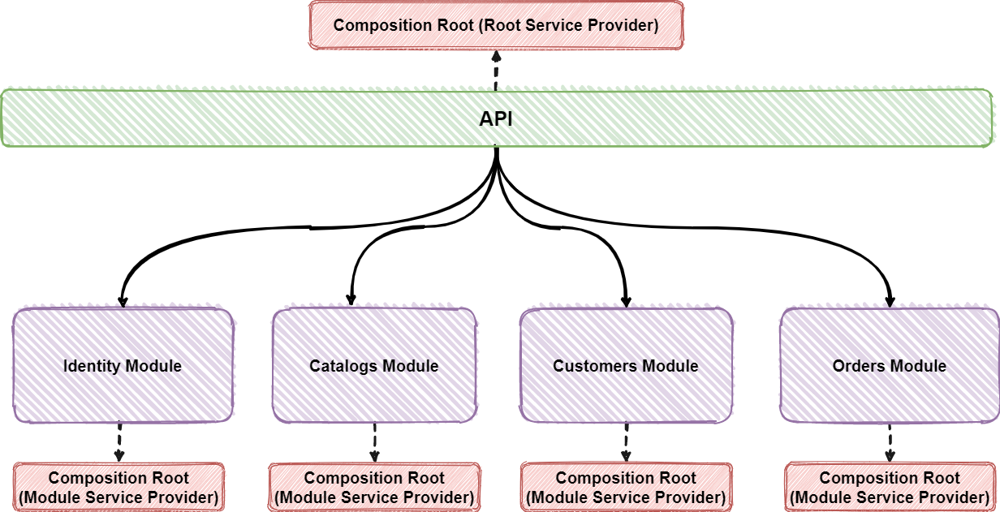
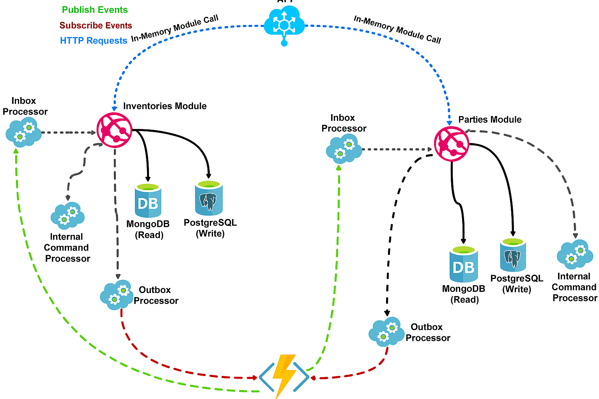

# NextGen Software Modular Monolith

---

## 📌 Overview

> `NextGen Software Modular Monolith` is a **practical** (imaginary business) application built with **.NET Core** and multiple software architecture principles:
>
> * Modular Monolith Architecture
> * Vertical Slice Architecture
> * CQRS Pattern
> * Domain-Driven Design (DDD)
> * Event-Driven Architecture

* **Module Communication**:

  * **Asynchronous** → via custom [In-Memory Broker](src/BuildingBlocks/BuildingBlocks.Core/Messaging/Broker/InMemory/InMemoryBus.cs)
  * **Synchronous** → via REST and gRPC

💡 The project is **technology-focused**, not business-oriented. Its main purpose is to serve as a **sample implementation** of modern architecture patterns.

🔀 This project also has a **microservices variant**: [NextGen-microservices](https://github.com/samerkour/NextGen-microservices).

⚠️ **Work in progress** – more features will be added 🚀

---

## ⭐ Support

If you find this useful, please consider giving it a ⭐.
Thanks for supporting me! 🙏

---

## 📖 Table of Contents

* [Plan](#plan)
* [Technologies & Libraries](#technologies--libraries)
* [Domain & Bounded Contexts](#domain--bounded-contexts)
* [Application Architecture](#application-architecture)
* [Application Structure](#application-structure)
* [Vertical Slice Flow](#vertical-slice-flow)
* [Prerequisites](#prerequisites)
* [How to Run](#how-to-run)
* [Contribution](#contribution)
* [Project References](#project-references)
* [License](#license)

---

## 📅 Plan

This project is continuously evolving.

| Feature         | Status       |
| --------------- | ------------ |
| Building Blocks | Completed ✔️ |

---

## 🛠️ Technologies & Libraries

* ✔️ [.NET 8](https://dotnet.microsoft.com/download)
* ✔️ [Npgsql EF Core Provider](https://www.npgsql.org/efcore/)
* ✔️ [FluentValidation](https://github.com/FluentValidation/FluentValidation)
* ✔️ [Swagger & Swagger UI](https://github.com/domaindrivendev/Swashbuckle.AspNetCore)
* ✔️ [Serilog](https://github.com/serilog/serilog)
* ✔️ [Polly](https://github.com/App-vNext/Polly)
* ✔️ [Scrutor](https://github.com/khellang/Scrutor)
* ✔️ [OpenTelemetry](https://github.com/open-telemetry/opentelemetry-dotnet)
* ✔️ [IdentityServer](https://github.com/DuendeSoftware/IdentityServer)
* ✔️ [Newtonsoft.Json](https://github.com/JamesNK/Newtonsoft.Json)
* ✔️ [HealthChecks](https://github.com/Xabaril/AspNetCore.Diagnostics.HealthChecks)
* ✔️ [JwtBearer Authentication](https://www.nuget.org/packages/Microsoft.AspNetCore.Authentication.JwtBearer)
* ✔️ [NSubstitute](https://github.com/nsubstitute/NSubstitute)
* ✔️ [StyleCopAnalyzers](https://github.com/DotNetAnalyzers/StyleCopAnalyzers)
* ✔️ [AutoMapper](https://github.com/AutoMapper/AutoMapper)
* ✔️ [ProblemDetails Middleware](https://github.com/khellang/Middleware/tree/master/src/ProblemDetails)
* ✔️ [IdGen](https://github.com/RobThree/IdGen)

---

## 🏗️ Domain & Bounded Contexts

TODO

---

## 🏛️ Application Architecture

* **Single Public API** hosting all internal modules.
* API routes requests to modules using **in-memory calls** via [`GatewayProcessor<TModule>`](src/BuildingBlocks/BuildingBlocks.Web/GatewayProcessor.cs).
* Each module has its own **Composition Root** (separate DI container).
* Modules are **autonomous** (like microservices inside the monolith).
* Communication between modules:

  * **Async** → In-Memory Broker (or external broker if needed)
  * **Sync** → REST or gRPC

### Key Architectural Patterns:

* CQRS for separating **read** and **write** models.
* SqlServer for **write side (ACID)**.
* MongoDB for **read side (scalability & performance)**.
* **Outbox/Inbox Patterns** for reliable messaging.
* **At-least-once delivery** + **Idempotent receivers**.

📊 Diagrams:

---

## 📂 Application Structure

Built using **Vertical Slice Architecture** + **Feature Folder Structure**.

* Each request = independent **slice**.
* Minimizes **cross-slice coupling**, maximizes **in-slice cohesion**.
* CQRS enables **scalability, simplicity, and maintainability**.

📊 Diagrams:

### High-Level Structure

TODO

---

## 🔄 Vertical Slice Flow

TODO

---

## ⚙️ Prerequisites

1. Valid HTTPS certificate ([Guide](https://docs.microsoft.com/en-us/dotnet/core/additional-tools/self-signed-certificates-guide#create-a-self-signed-certificate))
2. [Git](https://git-scm.com/downloads)
3. [.NET Core 7.0](https://dotnet.microsoft.com/download/dotnet/7.0)
4. Visual Studio 2022, Rider, or VSCode
5. [Docker](https://docs.docker.com/docker-for-windows/install/)
6. \~10GB free disk space
7. Clone repo → [NextGen-modular-monolith](https://github.com/samerkour/NextGen-modular-monolith)
8. Run infra → `docker-compose -f ./deployments/docker-compose.infrastructure.yaml -d`
9. Open solution → [NextGen.sln](./NextGen.sln)

---

## ▶️ How to Run

* Run: [NextGen.Api.csproj](src/Api/NextGen.Api/NextGen.Api.csproj)
* API Testing:

  * [REST Client (VSCode)](https://marketplace.visualstudio.com/items?itemName=humao.rest-client)
  * Swagger → `/swagger`
* Email: Uses [Ethereal](https://ethereal.email/) fake SMTP (see [settings](./src/Modules/Parties/NextGen.Modules.Parties/parties.appsettings.json))

---

## 🤝 Contribution

* Project is under **active development**.
* Feel free to open **issues** or submit **PRs**.

---

## 📚 Project References

* [modular-monolith-with-ddd](https://github.com/kgrzybek/modular-monolith-with-ddd)
* [EventSourcing.NetCore](https://github.com/oskardudycz/EventSourcing.NetCore)
* [eShopOnContainers](https://github.com/dotnet-architecture/eShopOnContainers)
* [ContosoUniversity](https://github.com/jbogard/ContosoUniversityDotNetCore-Pages)
* [clean-architecture-dotnet](https://github.com/thangchung/clean-architecture-dotnet)
* [CleanArchitecture](https://github.com/jasontaylordev/CleanArchitecture)
* [DDD-VShop](https://github.com/DijanaPenic/DDD-VShop)

---

## 📄 License

This project is licensed under the [MIT License](LICENSE).
